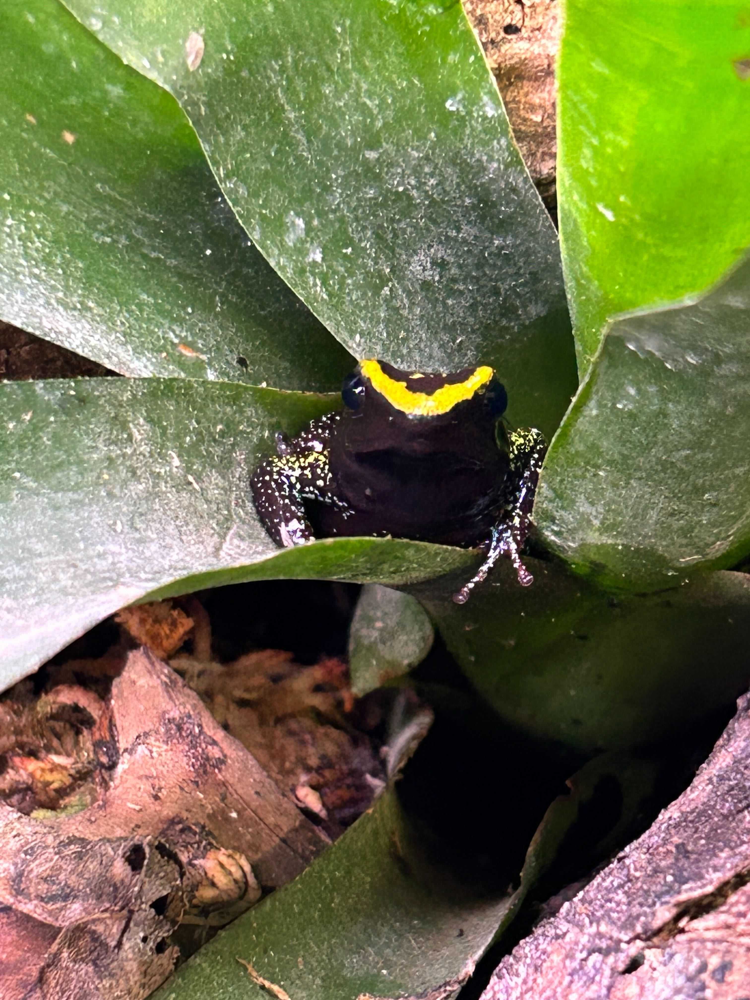

This repository contains code used to assess and compare publicly available whole genome sequences.

# Preparing Proteomes for Orthofinder

Amphibian proteomes were downloaded from NCBI using ncbi-datasets. I downloaded proteomes from reference genomes for all amphibians with annotations with the following code:

> datasets download genome taxon amphibia --reference --include protein,gtf,cds --annotated

By default, NCBI generates an individual folder per species labeled with their accession numbers.

I used custom python and bash codes: [**bash loop to extract longest proteins**](extract_longest_proteins_all.sh) ; [**python code to identify longest proteins in genomic gtf**](list_longest_protein.py) ; [**python code to pull longest proteins from proteomes**](extract_proteins.py) to extract a single longest isoforms per gene from each proteome. I then renamed the files by species [**bash loop to rename species**](rename_and_collect_by_species.sh) ; [**python code to rename species referencing the NCBI json report**](extract_accession_to_species.py).

The resulting filtered proteomes were used as inputs to Orthofinder.

